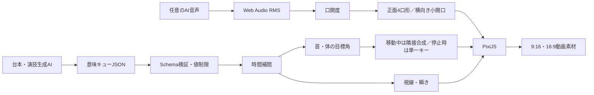

# 技術方針（character-v14）

## 結論

動画素材の制作・レビュー用途では、現段階でLive2D Cubismは必須ではない。正面と評価済みの
左右終点をアンカーに、首と体をそれぞれ左右16キーへ事前展開する。Webでは移動中だけ現在値を
挟む2キーを連続合成し、入力が止まって角度へ到達したら最寄りの単一キーへ固定する。これにより、
動作中の連続性を保ちつつ、静止画で隣接ラスターが二重露光のように見える問題を避ける。

横向きフレームでは、目周辺を「元の虹彩が残らないclean eye-base」「虹彩だけの可動レイヤー」
「動かさないまつ毛・アイライン」に分け、瞬きと小開口を独立パッチとして重ねる。首・体のどちらを動かしていても
`gazeX / gazeY / blink / mouthOpen` を維持し、視線移動後に元座標の虹彩を二重表示しない。
髪は各方向キーに焼き込まれた形を使い、正面PNGを引っ張る手動メッシュ変形は推奨モードでは
行わない。

任意角度で首、体、髪束、全母音、表情を完全に独立合成する段階になったら、隠し塗りを含む
素材分割とCubismのArtMesh・デフォーマ・物理演算へ移行する。

## 処理の流れ

AIは低頻度の意味指示だけを出し、毎フレームの座標、キー選択、補間、値制限は描画側が担当する。

## ランタイム素材

起動時に読み込む素材は39点。

- 正面: 一貫ベース1、開眼ベース、虹彩、半閉じ、閉眼、眉、口9種の計15点
- 首: 左右それぞれ `neutral / eye-base / irises / eye-line / blink / mouth-small` の計12 atlas
- 体: 左右それぞれ同じ6状態の計12 atlas

首・体のニュートラルは768×1024の16フレームを4×4 WebP atlasへ格納する。顔差分は固定ROIの
小型atlasにし、全画面の表情PNGを常駐させない。v10までの完成ポーズPNG 28点はランタイムから
外している。

## 首と体の連続キー

キー位置は `abs(value) × 15`。移動中は整数部を下側キー、小数部を上側キーのalphaとして表示する。
目標値が変わらず、現在値との差が0.004以下の状態が80ms続くと停止扱いにし、`round(abs(value) × 15)`
の1キーだけを表示する。同時に横向き全体へ掛けていたidle/breath由来の平行移動・回転・拡縮を
identityへ固定する。目標値が0.0005を超えて変わったフレームで即座に解除する。

### 首

- 右: `front → right-step-25 → right-step-50 → natural-right`
- 左: `front → natural-left`
- 追従率: 12/s。60fps換算12フレームで入力の90%以上へ到達

### 体

- 右: `front → right-step-25 → right-step-50 → right-step-80 → full-right`
- 左: `front → generated-left-33 → generated-left-66 → full-left`
- 追従率: 9/s。大きな動きの重さを残しつつ、離散カットは使わない

左体の33%・66%は組み込みImageGenで制作した専用アンカー。長区間を一度に光学補間せず、
3区間へ分けることで肩、ケープ、長髪の崩れを抑える。右と左右終点は既存の評価済み絵を保持する。

`parameter` で `turn` が非ゼロなら体系列を優先し、`turn` が中央なら `headTurn` の首系列を使う。
これは一枚絵同士の二重合成を避けるための優先規則であり、首角と体角の完全な直積合成ではない。

## 正面・横向きの目と口

v13では正面虹彩が承認済み完成眼より左右へ約13pxずつ外れ、虹彩下端にも白目帯が残っていた。
また横向きは、虹彩atlasへまつ毛片と旧虹彩フリンジが混入し、WebP圧縮とneutral眼からの
cross-fadeが移動開始時の輪郭ノイズを増幅していた。v14は次の構成へ変更する。

1. `identity-green-reference.png` と `identity-hero-reference.png` からdark / luminous虹彩を抽出
2. 正面重心を承認済みv5完成眼の画面左 `(455, 478)`・画面右 `(630, 478)` へ合わせる
3. 画面右＝キャラクター左眼は、瞳孔周囲の白い月輪を強めたluminous textureを使う
4. 首・体×左右64フレームで、伝播マスクを実虹彩へ再整列して姿勢別silhouetteを得る
5. silhouette内へ同じdark / luminous参照ペアを再描画し、外周alphaを定数境界でfeatherする
6. 旧虹彩と周辺フリンジは眼ごとの白目色へ置換する。消去マスクは横へだけ広げ、下まぶた・肌を白く塗らない
7. `eye-base / irises / eye-line` の3atlasをすべてlossless PNGで保存する
8. 欠けた遠眼の虹彩下半分を眼裂内の楕円で補い、元画像の下まぶたを固定前景として復元する

横向きは中央視線を含めてclean splitを常時使用する。描画順は
`neutral → eye-base → shifted irises → fixed eye-line → blink → mouth`。neutralに焼き込まれた旧虹彩は
eye-baseが完全に覆うため、分離眼を0.02〜0.10で半透明に重ねる処理は使わない。これにより、中央から
微小に視線を動かした瞬間にも二つの虹彩や旧輪郭が同時表示されない。固定上まつ毛はiris位置を変更しても
原座標のままである。

正面はX最大12px、Y最大7px、横向きはX最大5px、Y最大2pxの楕円内で虹彩を移動する。
`headTurn / turn` の絶対値0.035以下は正面扱いとする。正面瞬きはopen / half / closedの3キーで、
半閉じ中も虹彩transformと下まぶたを固定する。横向き瞬きは可動虹彩と固定線を非表示にして
姿勢別閉眼パッチを表示する。横向き口は閉じ口から静かな小開口までで、大開口と母音別口形はまだ持たない。

品質テストは正面の上まぶた鏡像、虹彩重心・下端・白輪、半閉じ・閉眼の固定角、口の+4px平行移動、
64フレームの左右2成分・base包含・固定上まつ毛、全右向きフレームの白輪、左右終端の旧虹彩消去、
露出白目の彩度、虹彩直下の白隙間を検査する。

## 正面レイヤー

下から順に、正面ベース、開眼ベース、可動虹彩、半閉じカバー、閉眼、眉、口差分を表示する。自動口形は
`closed → micro → small → wide`。手動レビューでは中開きの `a / i / u / e / o` を選べる。
母音Iを含む正面口9種は元の形を保ったまま右へ4px移動し、bbox中心x=547へ揃えた。
Iは52×15pxの浅いピンク口を維持する。
白い歯面・個別の歯・黒い口腔は持たず、v11の深い開口と白い帯は使用しない。

## 向きモーションの5モード

- `parameter`: `headTurn` と `turn` を別操作。首・体とも左右16キー
- `natural`: `turn` を首16キーへ割り当てる簡易操作
- `full`: `turn` を体16キーへ割り当て、既存3/4を終点として呼び出す
- `soft`: 比較用の旧・正面メッシュ小変形
- `head-only`: 比較用の旧・正面メッシュ大変形

モード切替時は現在角を正面へ戻してから新モードを適用し、保存した目標角へ復帰する。
`parameter / natural / full` は旧来の完成カット遷移、強制瞬き、曲線ワイプを起動しない。

## パフォーマンス方針

- 首と体の角度追従を個別レートにし、首の不要な待ちを削減
- URL書き換えを入力ごとではなく90msデバウンス
- 同じフレーム番号の間はPixiJS Textureを再代入しない
- 静止判定後は隣接キーを1枚へ畳み、横向き全体の周期変形を停止
- rendererのdevice pixel ratioを最大1.5へ制限
- 旧28ポーズPNGを起動時ロードから除外

WebPは転送量を減らすが、GPU上では展開される。低メモリ端末まで対象にする場合は、方向別atlasの
遅延ロード、解像度段階、未使用母音の遅延ロードを追加検討する。

## 現在の制約とCubism移行線

- 16キーは完成ラスターの光学補間キャッシュで、3D回転やCubism拡張補間ではない
- 動作中の中間角は光学補間由来の軟化を許容し、停止時は必ず単一キーを表示する
- `parameter` は体系列を表示中、別の首角を同時には合成しない
- 横向き口は小開口まで。母音5種は正面専用
- 髪束別の慣性、衝突、物理演算は未実装
- PSDは顔差分のレイヤー素材で、Cubismへの読み込み・ArtMesh設定は未確認

既定角の動画を作る現在用途なら、このキャッシュ方式で継続できる。任意の首角×体角×髪物理×
母音をリアルタイムに自由合成する要件になった時点が、Cubismへ移る明確な境界になる。
